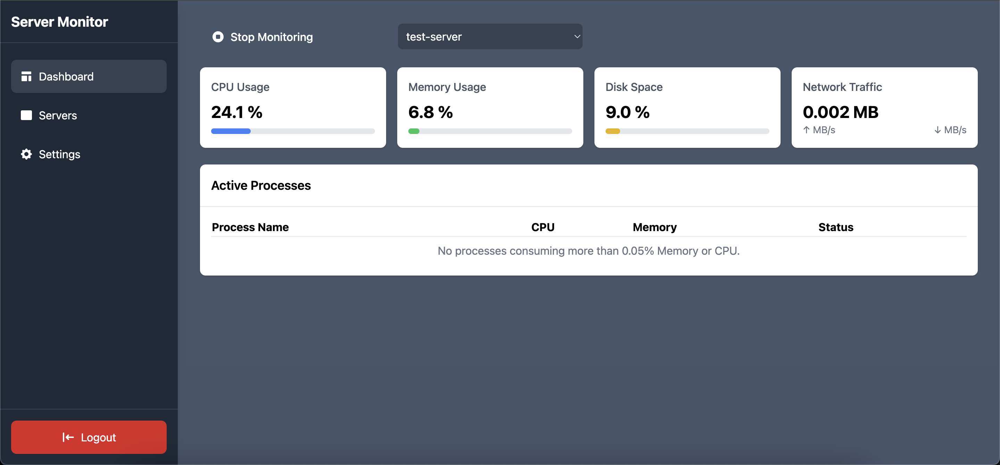
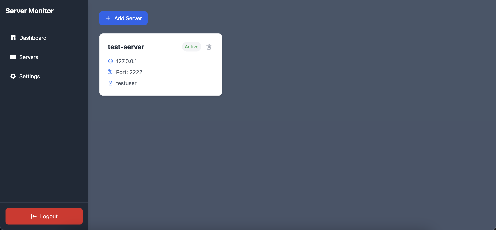
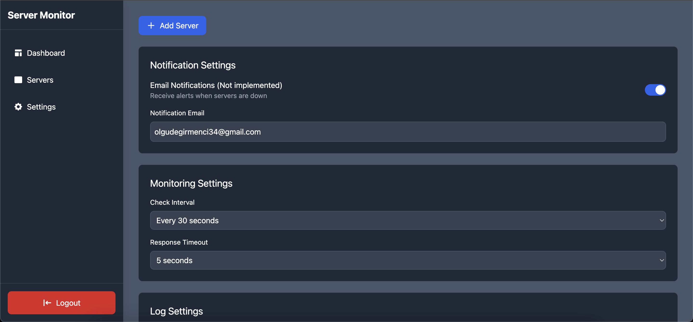

# Server Monitoring Application

A modern Django web application for monitoring and managing server statuses.

## Features

- 👤 **User Management** (Register, Login, Logout)
- 📊 **Server Status Monitoring**
- 🖥️ **Dashboard Viewing**

## Technologies

- 🐍 **Python** 3.12
- 🌐 **Django** 5.1.4
- 💅 **Tailwind CSS** 3.4.17
- 🗄️ **SQLite3**
- 📜 **JavaScript**

## Screenshots





## Installation

### Clone the Project

```bash
git clone git@github.com:OlguD/server-monitoring.git
cd server-monitoring
```

### Create and Activate Virtual Environment
```bash
python -m venv venv
source venv/bin/activate  # For Linux/Mac
# venv\Scripts\activate  # For Windows
```

### Install Required Python Packages
```bash
pip install -r requirements.txt
```

### Install Node.js Packages
```bash
npm install
```

### Apply Django Migrations
```bash
python manage.py migrate
```

### Compile Tailwind CSS
```bash
npm run dev
```

### Run the Application
```bash
python manage.py runserver
```

### Go To This URL
```bash
http://127.0.0.1:8000/
```

## Contributing

1. Fork this repository
2. Create your feature branch (`git checkout -b feature/amazing-feature`)
3. Commit your changes (`git commit -m 'Add some amazing feature'`)
4. Push to the branch (`git push origin feature/amazing-feature`)
5. Create a Pull Request


## License
This project is licensed under the GNU General Public License v3.0 - see the [https://github.com/OlguD/server-monitoring/blob/main/LICENSE](LICENSE) file for details.